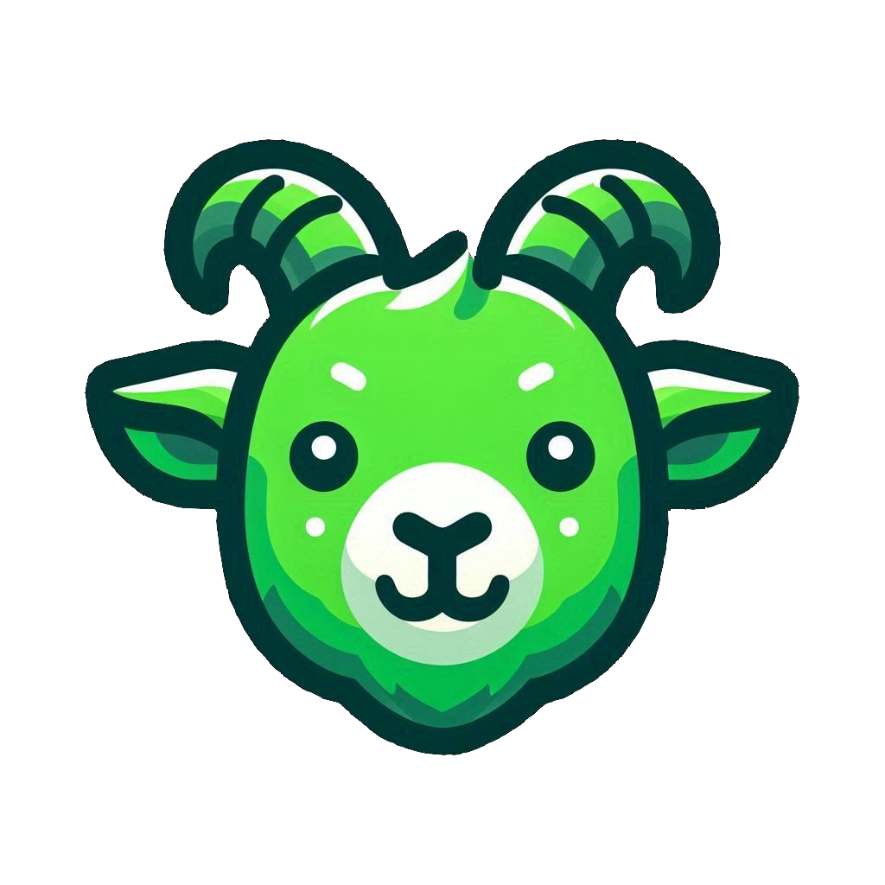

<p align="center">
  
</p>

# Project
This project is a school project of video game to learn game devolupment basics in unity.
This Game is a 2d based in The Jump king game the duretion of this project was 1 mounth.

# Tecnologies

| Field          | Technology          |
|:---------------|:--------------------|
| Languages      | |
| Game Engine    | |
| Other Tools    |  |

# User Manual
## Description
The Upward Goat is a challenging game, where you control a knight green goat that has to reach the top of the tower to save his beloved Miel. This game tests the precision of jumps and the patience of players who challenge it. With a tricky map that penalizes wrong jumps, it offers a rigorous and engaging experience.

## Game Objective
### Climb the Tower
The main objective is to guide Rocky through the floors to reach the top. Every floor has unique obstacles that you will need to overcome.

### Overcoming the Traps and Obstacles
You have to overcome different obstacles, such as walls with a hole underneath or ceilings that are close to you.

## Installation Instructions
### Windows
1. Download [TheUpwardGoat_Win_64](./TheUpwardGoat_Win_64.zip).
2. Unzip the file.
3. Open the unzipped folder.
4. Click on the executable which is the one that has an image of a green goat and is named TheUpwardGoat.

### Linux
1. Download [TheUpwardGoar_Linux](./TheUpwardGoar_Linux.zip).
2. Unzip the file with the folowing commad.
```
sudo unzip TheUpwardGoar_Linux
```
3. Go to the unzipped directory.
4. Add execute permissions with 
```
chmod +x TheUpwardGoat.x86_64
```
5. Finally, execute the program with
```
./TheUpwardGoat.x86_64
```

## System Requirements
### Minimum
- OS: Windows 10 64bits / Linux 64bits
- CPU: Intel Celeron N2840 2.2GHz / AMD E1-6015 APU
- RAM: 4GB
- Disk: 140MB

### Recommended
- OS: Windows 10 64bits / Linux 64bits
- CPU: Intel Core i5-10400 / AMD Ryzen 5 4600G
- RAM: 16GB
- Disk: 200MB

## Game Controls
The controls of this game are the keys A, D or left and right arrow to move the character. Also, by pressing the space key you can charge a jump; depending on how long you hold the key, the character jumps more or less.

## Confusing Mechanics
### Jump to the Side
To jump to the side, hold down the key of the direction you want, and after the character jumps, you can release the key.

## HUD
In the game HUD, the player will see:
- The jumps that have been made
- A chronometer that shows how much time it takes to complete the game
- The coins collected

## Progress System
The game has floors with platforms that you need to pass by jumping to reach the top of the floor. Moreover, every floor is more difficult than the previous one.

## Frequently Asked Questions
### How can I jump laterally?
You can see the instructions in the [confusing mechanics section.](#confusing-mechanics)

### I don’t quite understand how much charge the jump has. Can you put a bar to show it?
Curranly, the game doesn't have any bar to show it  

### Can I die in the game?
No, the character can’t die. The only penalty is that the character can stamp when the player falls a long distance.

# GDD
[Link GDD](https://docs.google.com/document/d/1VgxxuCSvGCzWxDun1XQHxuMfqwQwTTqKOMc0vwYH7Eg/edit?usp=sharing)

# Video demo
[Link video demo](https://drive.google.com/file/d/1s2VScJIoUy60GaVnfBrTmXpZqdVbl_t3/view?usp=sharing)

# Video tiktok

[Link video tiktok](https://www.tiktok.com/@jaververde/video/7375657551469317409)

